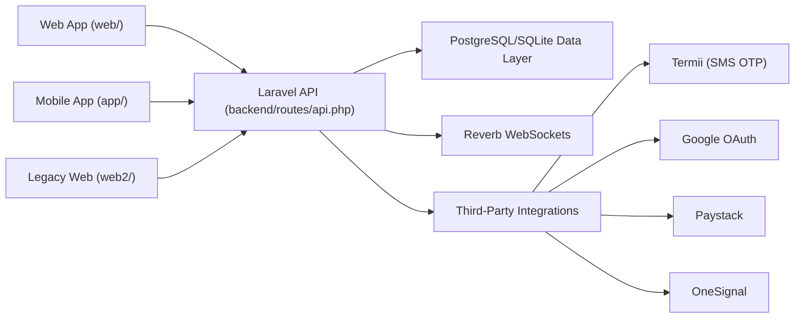

# Nyem Platform

Nyem is a multi-surface local commerce platform for:

- buying and selling (`marketplace`)
- item-for-item exchanges (`barter/swap`)
- finding and booking local service providers (`services`)

The platform combines discovery feeds, swipe interactions, trade offers, matching, chat, escrow/payment support, and admin tooling.

## What This Repository Contains

This is a monorepo with multiple applications that share one backend API:

- `backend/`: Laravel 12 API + admin web app (Inertia/React + Blade)
- `web/`: Primary React + Vite web client (current web app)
- `app/`: React Native + Expo mobile client
- `web2/`: Secondary/legacy React + Vite web client kept in-repo

## Core Product Capabilities

- **Authentication**: Phone OTP, email OTP, email/password, and Google OAuth
- **Listings**: Category-based listings with images, `marketplace`/`barter` types, pricing or `looking_for`
- **Discovery**: Public browsing feeds with category/location filters and listing engagement stats
- **Matching**: Swipe left/right/up, trade offers, pending requests, and item-specific match creation
- **Messaging**: 1:1 conversations with real-time events over Reverb channels
- **Trust & Safety**: Reports, blocks, reviews, and follower graph
- **Commerce**: Escrow lifecycle endpoints with payout/bank verification helpers
- **Service Providers**: Artisan profiles and service listing feeds
- **Admin**: Dashboard and management APIs/pages for users, listings, matches, and categories

## High-Level Architecture



## Backend API Domains

Main route file: `backend/routes/api.php`

- `auth`: OTP, login/register, Google OAuth, password reset
- `profile`: self profile, public profile, username check, notification/payment/security settings
- `listings/items/posts`: feed + CRUD + view/share tracking
- `swipes`, `trade-offers`, `message-requests`, `matches`
- `conversations`, `messages`
- `service-providers`
- `location` + geographic reference endpoints
- `escrows`
- `reviews`, `follow`, `report`, `block`
- `notifications`
- `admin` API resource routes

You can inspect current routes with:

```bash
cd backend
php artisan route:list --path=api --except-vendor
```

## Repository Map

```text
nyem/
├── backend/   # Laravel API, admin panel, events, services, migrations, tests
├── web/       # Main React web client
├── app/       # Expo React Native mobile app
├── web2/      # Older/alternate web client
└── *.md       # Project and feature documentation notes
```

## Local Development Setup

### 1) Backend (`backend/`)

Prerequisites:

- PHP 8.2+
- Composer
- Node.js 18+
- A configured database (PostgreSQL by default in `.env.example`)

Setup:

```bash
cd backend
composer install
cp .env.example .env
php artisan key:generate
php artisan migrate
npm install
```

Run backend API:

```bash
php artisan serve --host=127.0.0.1 --port=8000
```

Run backend frontend build/watch (for admin assets), if needed:

```bash
npm run dev
```

### 2) Main Web App (`web/`)

```bash
cd web
npm install
npm run dev
```

By code, the web app reads `VITE_API_BASE` and falls back to `http://localhost:8000/api` in local development.

Example local env:

```env
VITE_API_BASE=http://localhost:8000/api
VITE_GOOGLE_CLIENT_ID=your_google_client_id
VITE_ONESIGNAL_APP_ID=your_onesignal_app_id
VITE_PAYSTACK_PUBLIC_KEY=your_paystack_public_key
```

### 3) Mobile App (`app/`)

```bash
cd app
npm install
npm start
```

Default mobile API fallback in code uses port `8001` (`app/src/utils/api.ts`), so set `EXPO_PUBLIC_API_BASE` explicitly to match your backend:

```env
EXPO_PUBLIC_API_BASE=http://localhost:8000/api
```

### 4) Optional Legacy Web App (`web2/`)

```bash
cd web2
npm install
npm run dev
```

## Admin Surface

Backend web routes in `backend/routes/web.php` expose admin login/dashboard paths:

- `/login`
- `/admin`
- `/admin/users`
- `/admin/matches`
- `/admin/listings`
- `/admin/categories`

Admin API routes are under `/api/admin/*`.

## Realtime and Notifications

- Realtime events: `MatchCreated`, `ConversationCreated`, `MessageSent` (see `backend/app/Events/`)
- Broadcast channels: `user.{id}` and `conversation.{id}` (`backend/routes/channels.php`)
- WebSocket backend: Laravel Reverb (`laravel/reverb`)
- Push notifications: OneSignal integration (`backend/app/Services/OneSignalService.php`)

## Testing

Backend tests live in `backend/tests` and include auth, item flow, moderation, and swipe/chat coverage.

Run:

```bash
cd backend
php artisan test
```

List tests:

```bash
php artisan test --list-tests
```

## Related Documentation In-Repo

- `APP_FLOW_DOCUMENTATION.md`
- `WEBSOCKETS.md`
- `GOOGLE_OAUTH.md`
- `LOCATION.md`
- `ADMIN.md`

These files provide deeper feature-specific implementation notes.
